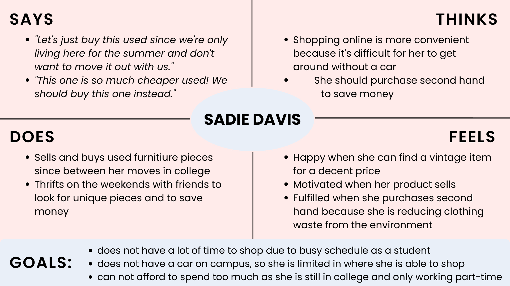

# DH 110 Assignment 4
#### Ashley Lee

## The Purpose of UX Storytelling
The purpose of UX Storytelling is to place your shoes in the user's and better understand where they are coming from. By taking a deep dive into your target user, you can gain insight about their behaviors, habits, story, and frustrations. Storytelling allows you to use this information to design a product focused on the user, rather than your own ideologies or biases that you may initially have. This ensures that you are not designing a product solely based on your own ideas and are working toward creating one that is user-centered. 

## Tasks to Propose for the UX Design
1. **Price Comparison Between New and Used Items**
   - This feature will allow users to compare the used item with the new item when shopping. Users will be able to easily see how a specific product compares when it is used vs. when it is new. This can help buyers to decide if this item is worth purchasing used or new, since oftentimes, shoppers are stuck between deciding to purchase a new or used item because of price or other factors.
3. **Product ID Feature**
   - When listing a product on the marketplace, this feature will pull up the product's original selling page after the user inputs keywords and searches for the item. This will allow buyers to have more details about the product itself and can also help the seller to have a baseline when pricing the item.

## Persona & Empathy Map

### Persona 1: Sadie Davis - rising college gradudate

#### Sadie's Empathy Map

### Persona 2: Linda Ortiz - the overwhelmed stay-at-home mom 

#### Linda's Empathy Map

## Scenarios & Journey Map

### 1. Sadie's Scenario & Journey Map
#### Why Sadie is using this product
> Sadie currently sells and buys used items online because it is much convenient for her to do so there than in person. As Sadie is moving in to her new apartment in Seattle for the summer, she is looking to furnish her place to make it feel like home. However, knowing that she is only living here for a summer, she looks for items that are used so they can ideally save money and not have to invest in something she can not bring home with her. In the same way, she decides that she can sell these items after moving home and needs a platform to do so. Sadie decides to browse for and sell used products in a central place online (in the application). 

#### How Sadie is using this product
> Sadie browses through the application several times a day to see what is available at the moment. She searches for furniture, such as a coffee table. While browsing, she wants to compare prices with new pieces to ensure that she is getting the best deal, even if she is only temporarily owning this coffee table. She thinks that if she is to buy this product brand new for a comparable price, she may be able to make more money off of it when trying to sell it later. She uses the price comparison feature that allows her to do this easily, without her needing to google or search for it herself. With the click of a button, she can see other listings of this product from retailers. She can use this to decide if the product is worth purchasing used or new. 

#### Sadie's Journey Map

### 2. Linda's Scenario & Journey Map
#### Why Linda is using this product
> Linda is cleaning out her children's closet and ends up with a large pile of clothes that her children have outgrown and can no longer wear. She doesn't really have anyone to give them away to and realizes that if she's going to keep purchasing clothes since her children outgrow them so fast, she might as well try to sell them and see what she can get to put towards new purchases. 

#### How Linda is using this product
> Linda compiles all the clothing items and lists them on an online application. As she is uploading the images of her products and their specifications, she realizes that it would be helpful if people could be linked to the original product retailer. Not only does this provide better photos for potential buyers, linking the product page can also provide more information that Sadie may not know about. This feature is convenient and pulls up the site without her searching for it. 

#### Linda's Journey Map

## Reflection
* After working on this project, I realized that coming up with personas was much more difficult than I expected. It was difficult to try to put my shoes in another person and fully understand their behaviors and tendencies without fully being them. It was also difficult to put aside any biases I had in order to better understand and develop my user. In the future, I can spend time doing more research, such as listening to anecdotes from these types of people I am writing about in order to better portray them and their stories.

