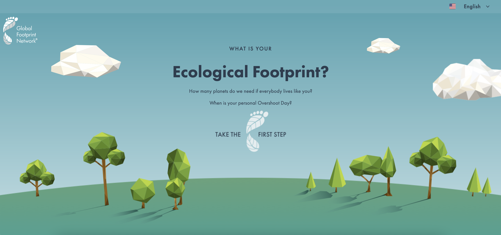

# DH110-22F

## Reducing your Ecological Footprint
### Ashley Lee, DH110

For my project, I want to provide ways that people can calculcate and learn more about their ecological footprint and provide ways for them to improve their consumption, ultimately reducing their ecological footprint. I want to provide a way for users to be able to better understand what their footprint means so they can find that reducing their consumption does not need to be that difficult.

### Website 1: Footprint Calculator by Global Footprint Network

https://www.footprintcalculator.org/

About: This website provides a series of questions to evaluate your ecological footprint, which is returned at the end of the survey. It then provides suggestions for how you can reduce your footprint based off your responses.

Overall evaluation: I would rate this website to be a 8/10 because it provides rather a user-friendly experience. The page is visually appealing and easy to use, which allows the user to truly engage with the product and make it through the end of the survey. However, I believe there are some areas that can be improved, which will be discussed below.

