# DH 110 Assignment 5
#### Ashley Lee

## Overview

### Purpose 

For this project, I chose to redesign the Facebook Marketplace page. This platform allows people and businesses to buy and sell items within their community and neighborhood and is used widely by users on Facebook. I want to redesign the buying and selling functions on the page, since these are the main activities that users engage with. 

By making a low-fidelity prototype for my project, I am able to test out my ideas with my target users before diving into the high-fidelity prototype. This provides me with a quick way to test the contents of my design without investing too much time and energy into a high-fidelity design and possibly realizing that several issues need to be addressed and fixed. 

### User Research
Based on my contextual inquiry, I will focus on these two research questions:
* How might we allow sellers to easily list their items in an accurate way?
* How might we allow buyers to trust their sellers when browsing for items on this platform? 

Here is more information on the [user research](https://github.com/ashleyalee/DH110/tree/main/assignment3).

### Personas and Scenarios
I created two personas and scenarios centered around features that would solve each research question.
* A rising undergraduate college student who needs to furnish her apartment but does not want to invest in furniture since she is only living at this apartment temporarily and also wants to live a more sustainable lifestyle. She also plans on selling these items once she moves out to get rid of them but also as a source of income as a side hustle. However, she is skeptical of the sellers on the platform and always needs to verify before making any purchases. 
* An overwhelmed stay-at-home mom who needs to shop for her family. She understands that her children grow out of clothes quickly, so she wants to purchase second-hand. She always compares prices with first-hand items to ensure her purchase is worthwhile. As a consequence, she also wants to sell their clothes online since they're only worn for such a short period of time. 

Here is more information on the [personas and scenarios](https://github.com/ashleyalee/DH110/tree/main/assignment%204).

### Tasks/Features
1. List a product and reference its existing product page from a third party vendor's site (so buyers can see full product description and original price).
2. Seller verification system that allows buyers to message sellers and also write/read reviews about buyers only after purchasing from them. 

## Wireframes
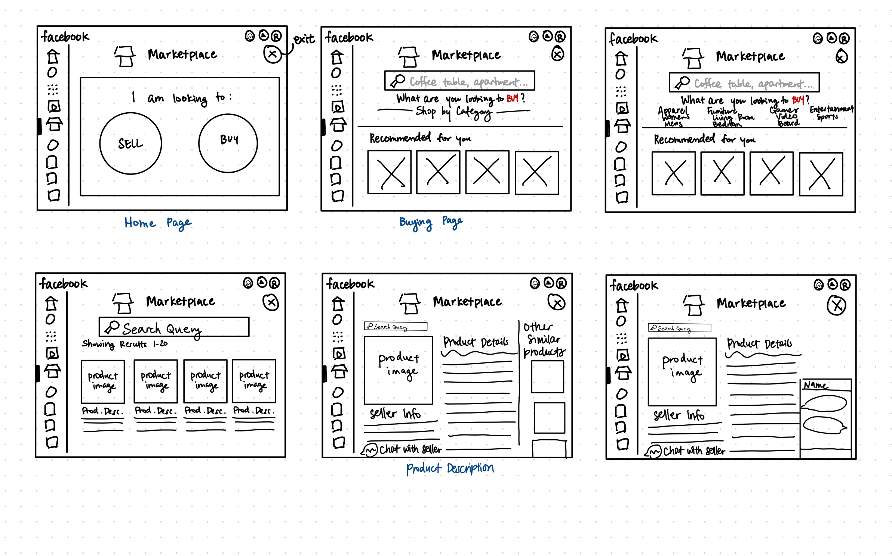
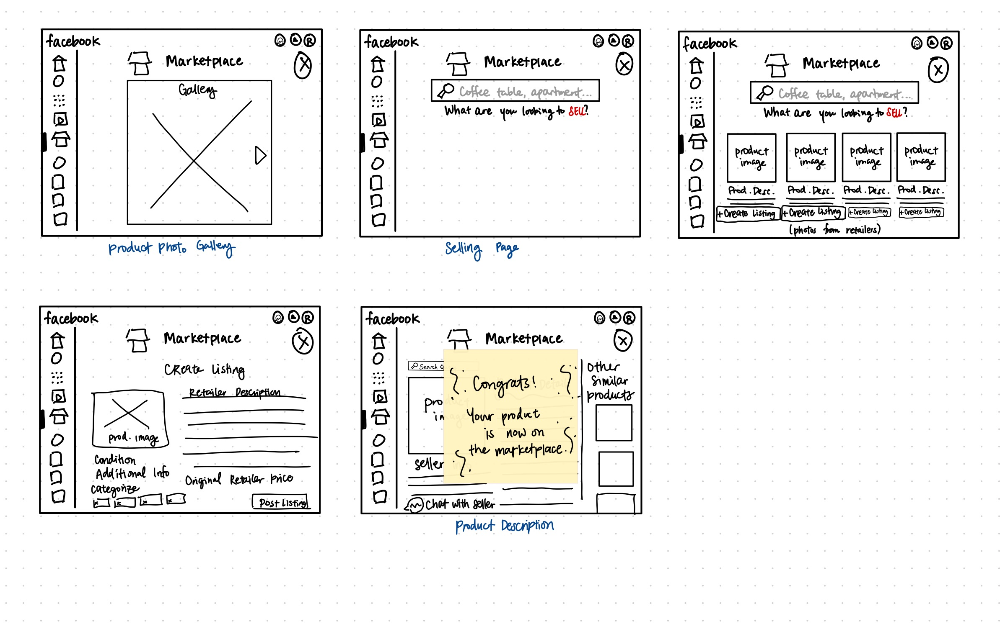

## Wireflows
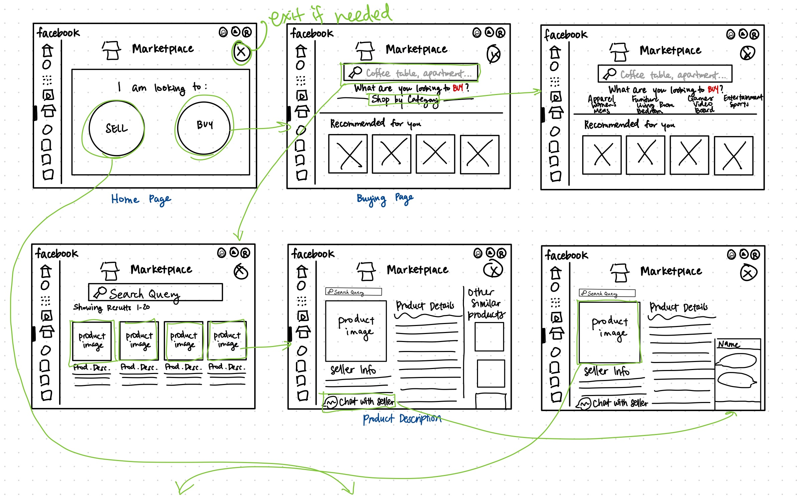
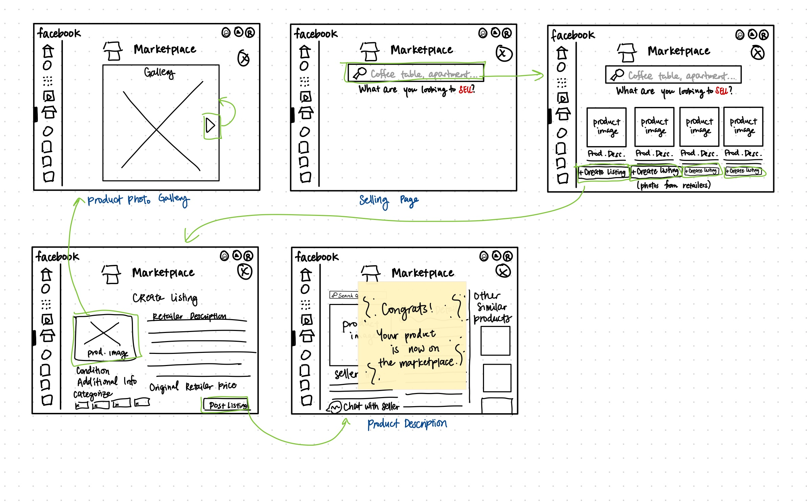
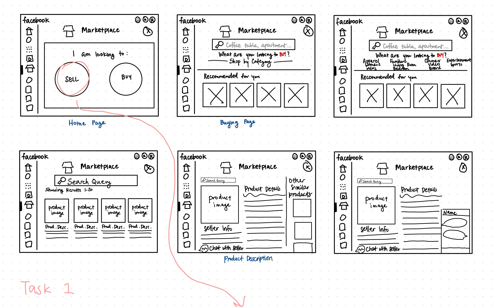
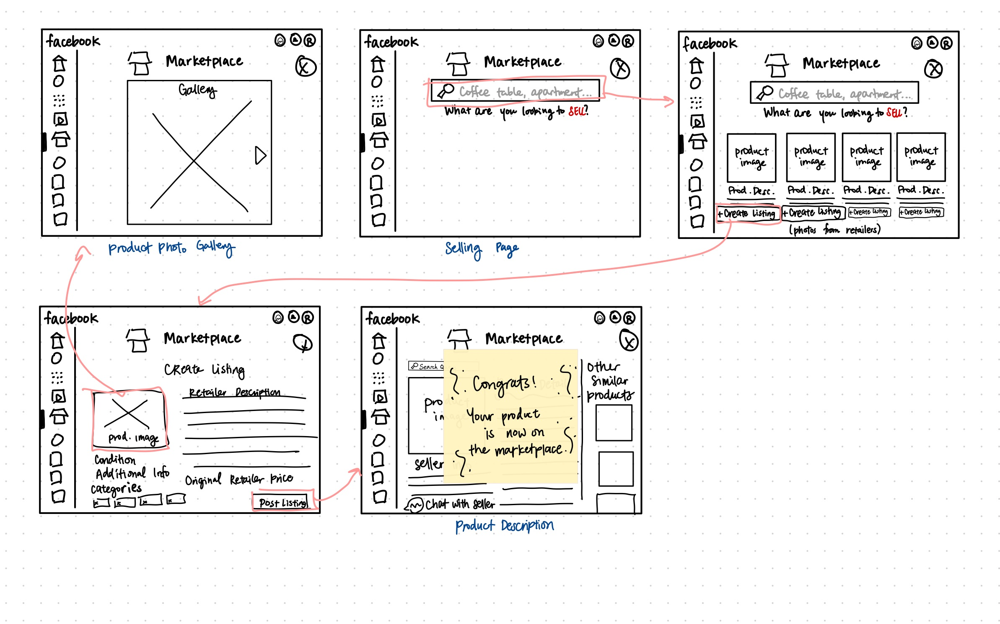
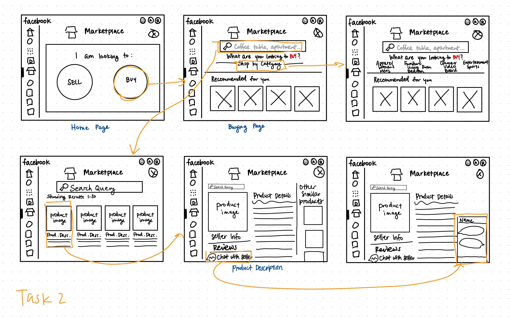

## Low-Fidelity Prototype Testing
(All researcher notes are on post-it notes)

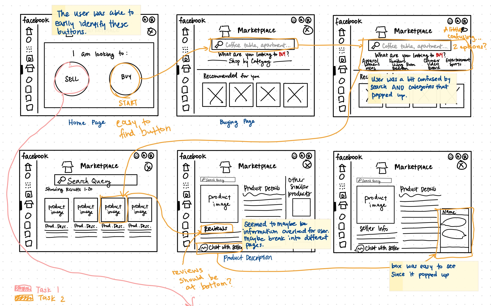
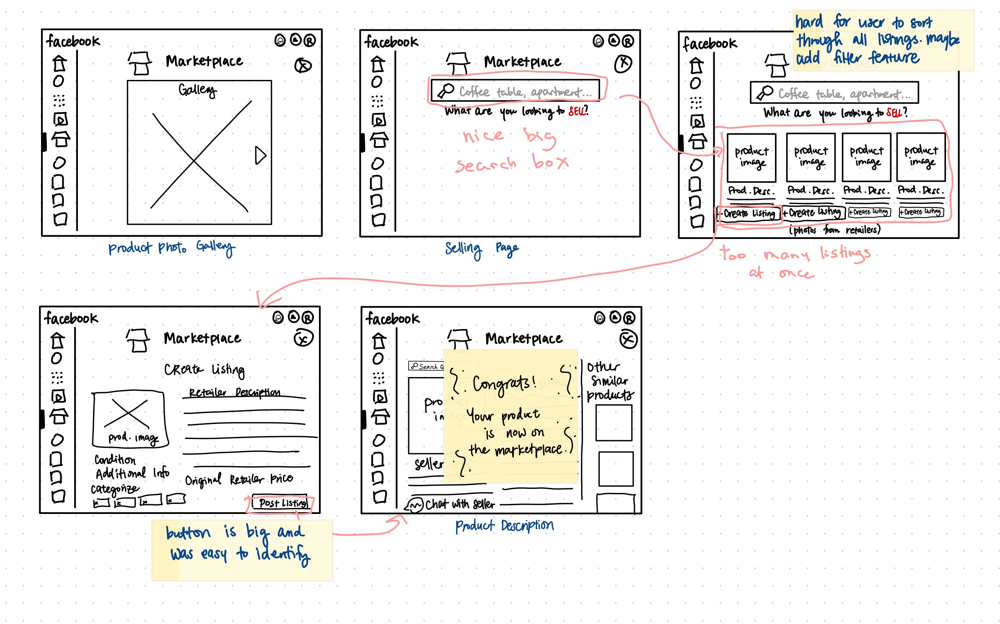

### Prototype Testing Photos

| Photo 1  | Photo 2 | Photo 3 |
| ------------- | ------------- | ------------- |
| 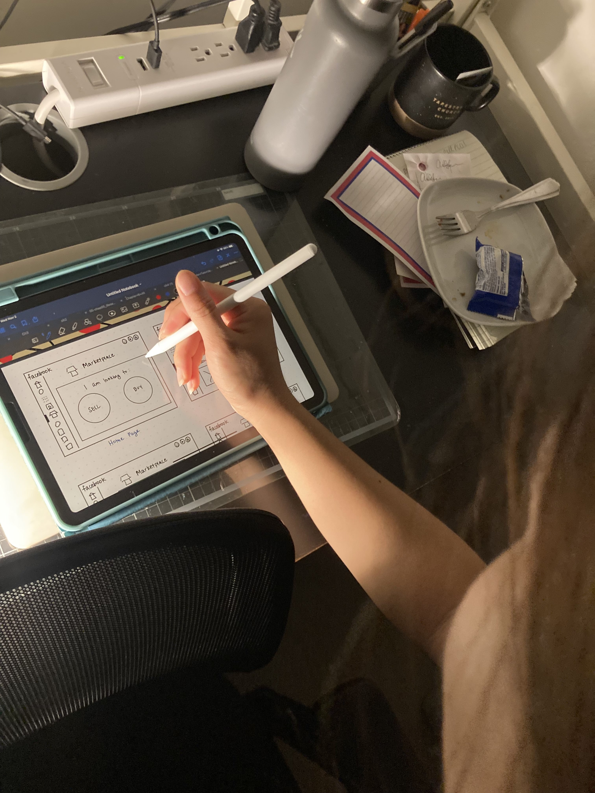 | 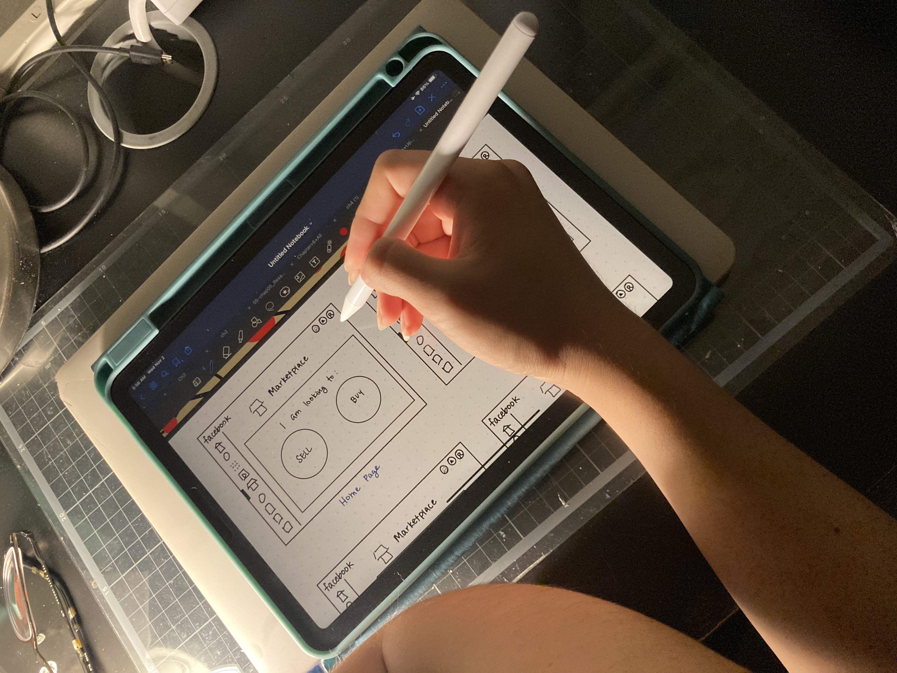  |   |

### Main Areas of Improvement

From conducting this low-fidelity prototype test, I learned that there are several changes I can apply to my prototype before entering the high-fidelity prototype stage. These notes were also labeled on post-it notes, but here they are explained in more depth. 
- The large SELL/BUY buttons were easy for the user to identify since there was not much else going on the screen. Since the later wireframes got more busy with text and buttons, I should lean towards having less visual information on one screen to prevent the user from getting overwhelmed with information. 
- The user had a difficult time when searching for an item to purchase, as there was a search box AND category selection after pressing the 'category' button. I should only let one option appear at a time to make it clear to the user what their options are.
- On the product description page, the user was a bit overwhelmed by all the information there was. Perhaps the information can be dispersed so it is not as condensed.
- When trying to 'sell' an item, the feature that allows for the user to identify the retailer page that matches their item was a bit difficult to use. The user had to spend some time filtering through all the options since there were a lot available and the one they were looking for was not directly at the top of the page. I could try implementing filter options in the future to narrow the selections down.
- However, overall, the user was able to complete both tasks. There were just some roadblocks that caused them some frustration or led them to complete it at a slower rate than expected.

### Reflection

This was my first time creating a low-fidelity prototype and I really enjoyed the design process. While it was difficult trying to draft up an entire website, it was helpful to use the existing Facebook Marketplace page to have an idea of what the backbone of the page should be looking like. There were a lot more details than I had to consider, which made it difficult. For example, I initially left out an exit button, because it was not at the top of my head, since I was so focused on how the user should achieve the task, amd not actually leave it if needed. 

While I did test my designs with someone this time, there is still a high chance that I missed certain buttons since this was not a digital prototype test and was only through drawings. I will need to more thoroughly try my product and all its features to ensure that I did not miss anything that would cause the user to have a difficult and unenjoyable experience. Having the notes to bounce off of now will be helpful, since I can apply these to my high-fidelity prototype. It was so surprising that my user interacted with the product and had trouble with it in ways I did not think would be an issue. This emphasizes why low-fidelity testing is so important and a necessary step of the product design cycle. 
