# Interface Design
## Assignment 6
Ashley Lee | DH110

## Project Description

This assignment aims to explore potential designs of my marketplace platform. The platform allows users to sell and buy second hand products while learning about the impact their actions (selling/buying a specific product) have on their ecological footprint. For example, with each product page that users are looking to purchase, there is a feature that will tell them how much of their ecological footprint they are reducing. The screen that I chose to design is the homepage, which asks the user what they are trying to do: sell or buy a product. 

## Purpose of UX Interface Design

The purpose of UX Interface Design is to convert low-fidelity wireframes into digitized designs that can later be transformed into interactive prototypes and eventually a final application. This provides the designer with another opportunity to get feedback and test out their design from a target user.

## Design Process

I based this interface design off of my low fidelity prototype as a reference. However, there are some changes in the design since I wanted to test out a slightly different idea to involve the ecological footprint factor. I started off with an iPhone 8/SE frame. I drafted out the layout from my low-fidelity prototype and included more details. This frame captures the main features of the application, allowing users to select if they are trying to purchase or sell an item and explore other items catered to their interest in an 'explore' page. During my process, I tested different typography, shape, and color variations for the app's main "Sell/Buy" page. After completion of the design, I ran two impression tests to further assist my process. I also ran an accessibility test to check for proper color contrast.

- [Figma Full Design Page](https://www.figma.com/file/4qjFBNtGzTSTBwis2NiGIn/Untitled?node-id=1%3A2)
  - includes test screens, design system info, and digitized wireflow

#### Initial Wireframe of the "Lessons" Page that I will design:
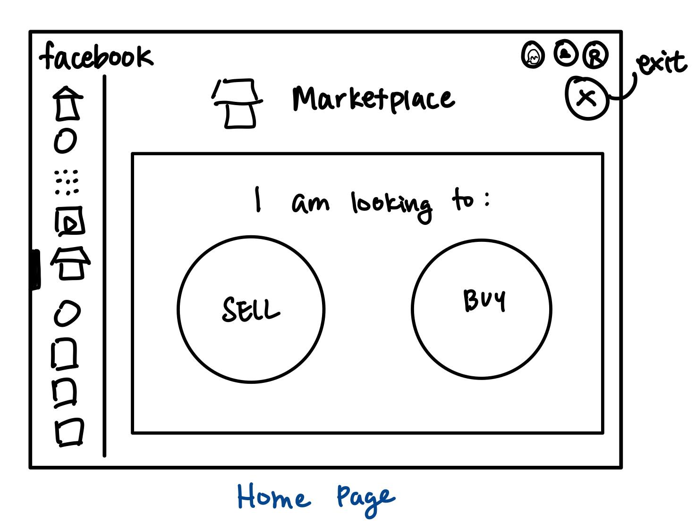

This slightly differs from what I ended up designing because I thought it would make more sense to combine some of the frames I had in my low-fidelity prototype. It would make more sense to have the "Just for you" page merged with this page, so that the user can see it. 

## Graphical Interface Design Variation

## Design and GUI Component Layout

### Decision Process and Design Details
I decided to design the main "Sell/Buy" page. I chose this frame because it captures the main page of functions that the user can do on the app, which are to either buy or sell products. The overall layout of this page includes a search bar for what item they are looking to buy/sell, and then two buttons that allow them to choose whether they are trying to buy or sell that product to complete their search query. Below this section are some products that are generated to their liking for them to explore. The overall layout of this page includes a menu button, chat button, title of the application, sell/buy buttons, search bar, and product images. For the grid layout, I utilized 5 rows with 20px gutter and 20px margin, and 2 columns with 20px gutter and 20px margin. The rows were used to align the different sections of the page, including the search bar component and the 'explore' section. The columns were used to align the product photos in the 'explore' section, since I wanted to have two columns of products. To incorporate Gestalt's principles of design, I tried to incorporate a symmetric layout, hence the distirbution of elements in the page.

## Typography Variations

### Decision Process and Design Details
I tried out the following typography variations using [Google Fonts](https://fonts.google.com/): Averia Serif Libre, Bellota Text, and Roboto Slab. I wanted to find a balance between something that was playful and professional. I decided to try out Averia Serif Libre as something that was more professional. However, it ended up looking a bit too serious/ancient so I tried to find something that looked more 'light-hearted'. I then tried out Bellota Text, which seemed to be more casual and less stern. However, I felt that I wanted something that had a bolder appearance, especially when presenting the application's name. I then tried out Roboto Slab, which had a balance between these two fonts. Since I wanted that bolder presentation of the logo, I used Roboto Slab. I also wanted the 'Buy' and 'Sell' buttons to stand out, so I used Roboto Slab for those. For the remaining text on the page, I settled on Bellota Text, since there were not too bold but were still clear enough to clearly communicate to the user. My final topography is shown at the very right in the image above. 

***Details for these fonts are below:***

| Text | Typeface | Font Size | Weight |
|---|---|---|---|
| Main Title | Roboto Slab | 54px | Regular |
| "I am looking to..." | Bellota Text | 16px | Italic |
| Button Labels | Roboto Slab | 14px | Medium |
| Photo/product descriptions| Bellota Text | 12px | Regular |

## Button Variations

### Decision Process and Design Details
I tested the three following button variations: rectangle with sharp corner, circle, and rectangle with rounded corners. I decided to try out the rectangle with sharp and rounded corners since I thought those were pretty standard button design in web applications. For my third option, I decided to try out circles, since that was initially what I envisioned when illustrating my low-fidelity prototype. However, the circles did not seem to fit as nicely on the page and was in an awkward position. while they are the main focus of the home page, there seems to be too much focus on the buttons when they are designed as circles. I decided to go with the rectangular buttons with rounded corners, because they can successfully convey their purpose to the user while not distracting them from the other features on the page.

I chose not to change the structure of the photo placeholders since I would like to keep them standard. 

***Details for the button I chose are below:***

| Width | Height | Padding | Radius |
|---|---|---|---|
| 88px | 33px | 16px (horiz), 12px (vert) | 12px |

## Color Variations

### Decision Process and Design Details
I tested three different color variations. I used [Coolors](https://coolors.co/palettes/trending) for color pallete inspiration to use in my design and then combined colors to make my own palette. Because this product is oriented toward sustainability and improving the Earth, I wanted to choose earthy tones that would hopefully allow the user to feel a sense of calmness. Typically, green colors remind people of nature. I feel that the green would help the users feel a closer connection to the earth/sustainability and would give them the mindset to want to be more environmentally conscious. I created two iterations of a light mode and one dark mode option. 

## Layout Test
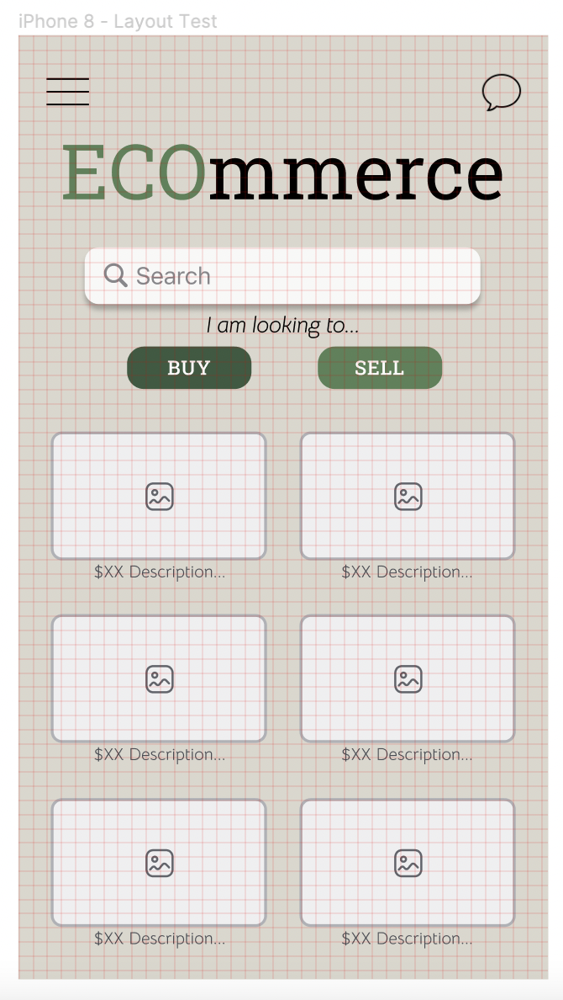

To run the layout test, I applied the 10px grid to my frame. This allowed me to realign all the elements with the grid to make sure that everything was properly aligned and sized. All the photos are 9x15 grid, buttons span 3 grids tall, and search bar 4 grids tall. 

## Impression Test
For my impression test, I ran the 5-second test. I showed a target user my design for 5 seconds and then asked for their first impressions on it. I then let me user look at the product in Figma without a time limit to see if they had any other opinions and suggestions for improvement on it. 

### Five-Second Test Results
I have included the quotations/transcript from the impression test with my target user. My user was not comfortable sharing the recording so I transcribed it instead. 

**[Interview Transcript](https://docs.google.com/document/d/1fdrBGBDazUlOTNI2zCBX3y8Qy0AD58np22nA3_rH_7I/edit?usp=sharing)**

**Key Quotes:**

>I think the photos being on this page threw me off a little bit because it seems a little out of context since it’s hard to tell what they are...Maybe if you could add a header to show that this section consists of products that are catered to them, that would help.

>I think the different colors in the sell and buy buttons might be a little inconsistent... you could try making them both the same color to see how that would work out?

>I like that the colors on the page are related to sustainability and the Earth.

When I asked for their opinion on the design, these are some of the key takeaways from the interview:
### Color Palette 
- Earth color tones reminded her of sustainability
- It was easy to read the words on the buttons 

### Typography
- Text was easy to read and the text on the buttons stood out 
- The logo stood out since it was large and a different font

### Layout
- Possibly add a header to the photos so that the user could tell what that section is for

## Feedback Integration
After the Impression Test, I incorporated some of the feedback to improve the interface and usabiity of my product. I added a label above the photos so it would be more clear what the photos in that section are for. However, I chose to leave the colors of the buttons the same since I wanted there to be a difference between the buttons.

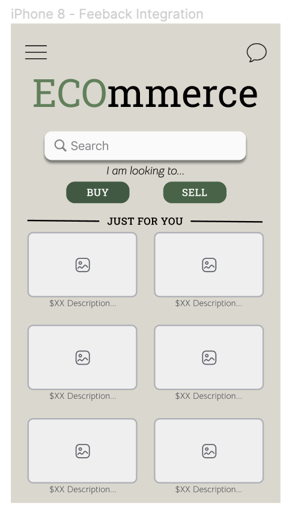

## Accessibility Test
To run a color-contrast check of my final design, I utilized the Color Contrast plugin in Figma. The test results are shown below:

| Header + Background | Text + Background  | Subheader + Background  |
| ------------- | ------------- | ------------- |
| 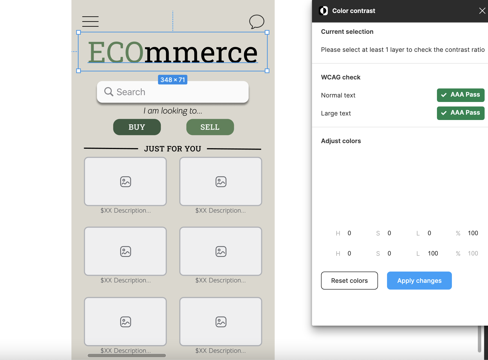 | 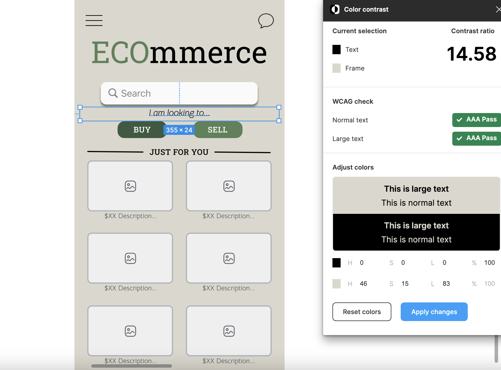  | 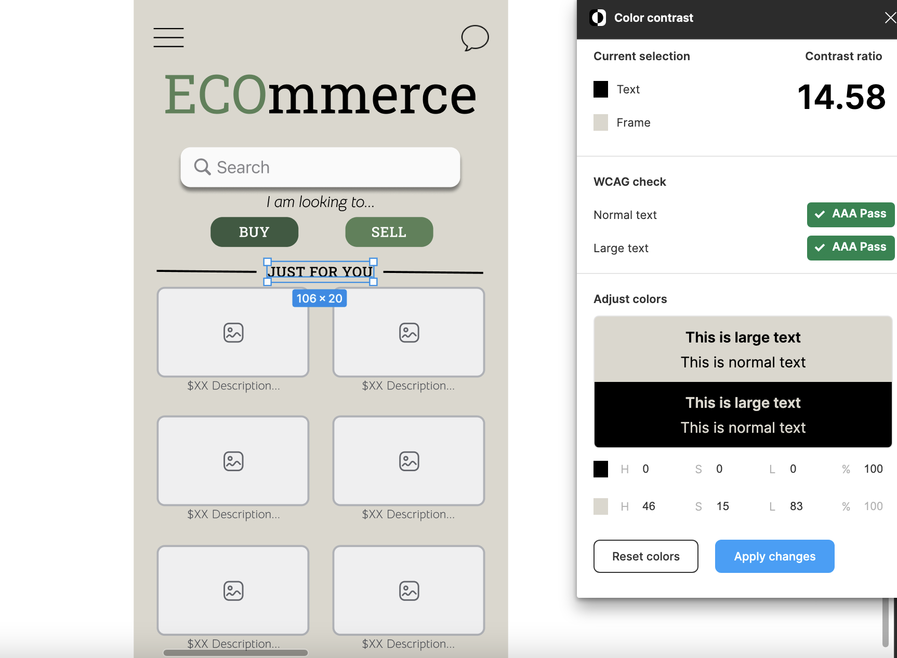  |

| Subtitle + Background | Button + Background  | Button text + Background  |
| ------------- | ------------- | ------------- |
| 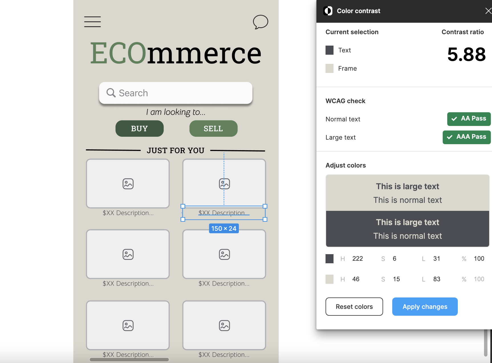 | 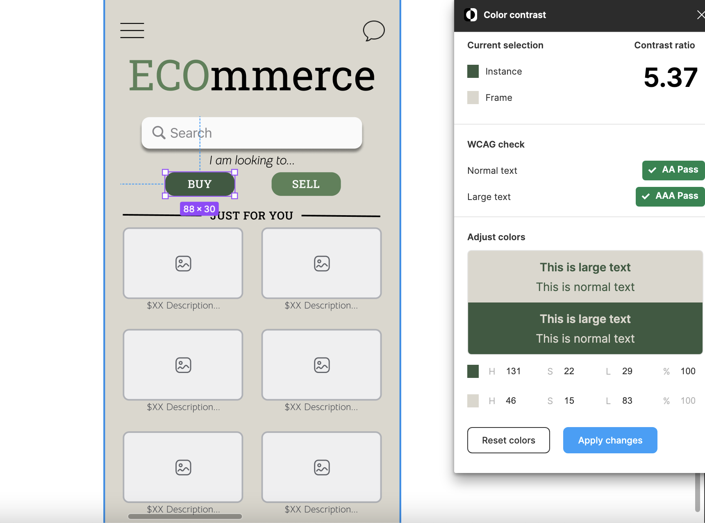  | 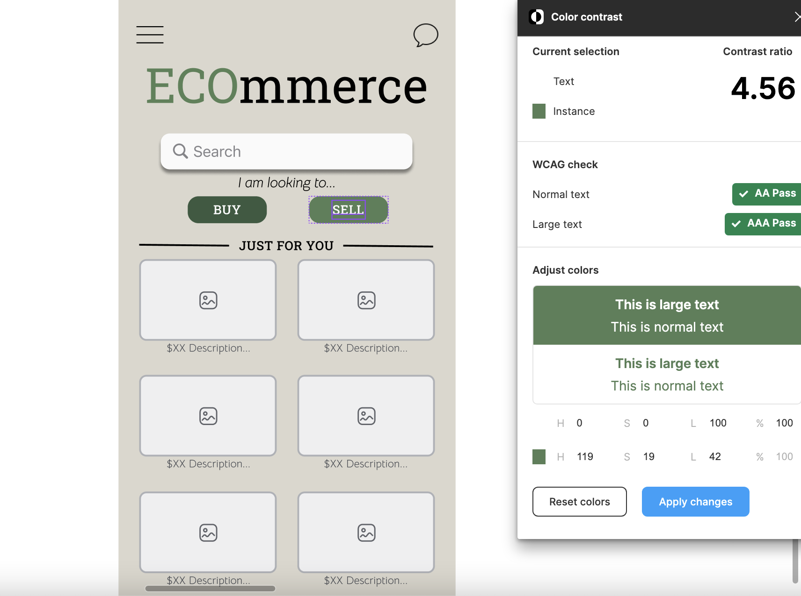  |

| Button text + Background | Button + Background  | Chat button + Background  |
| ------------- | ------------- | ------------- |
| 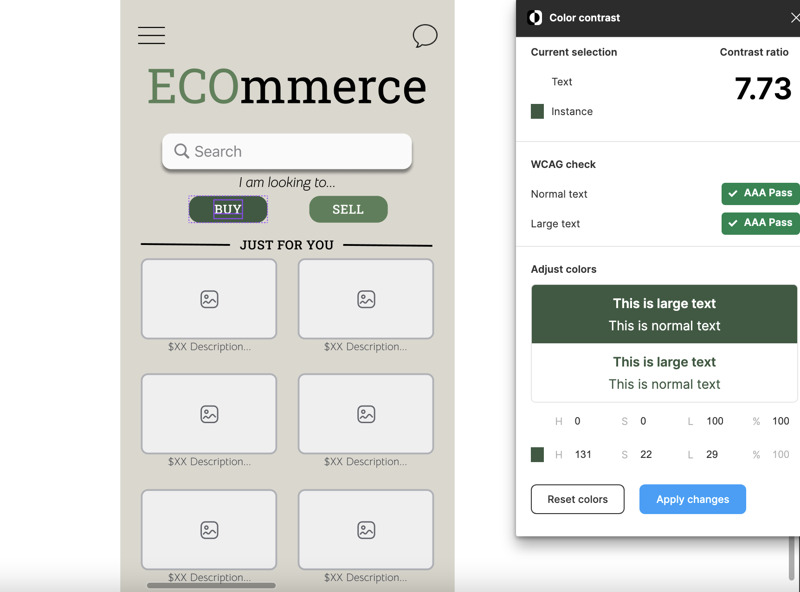 | 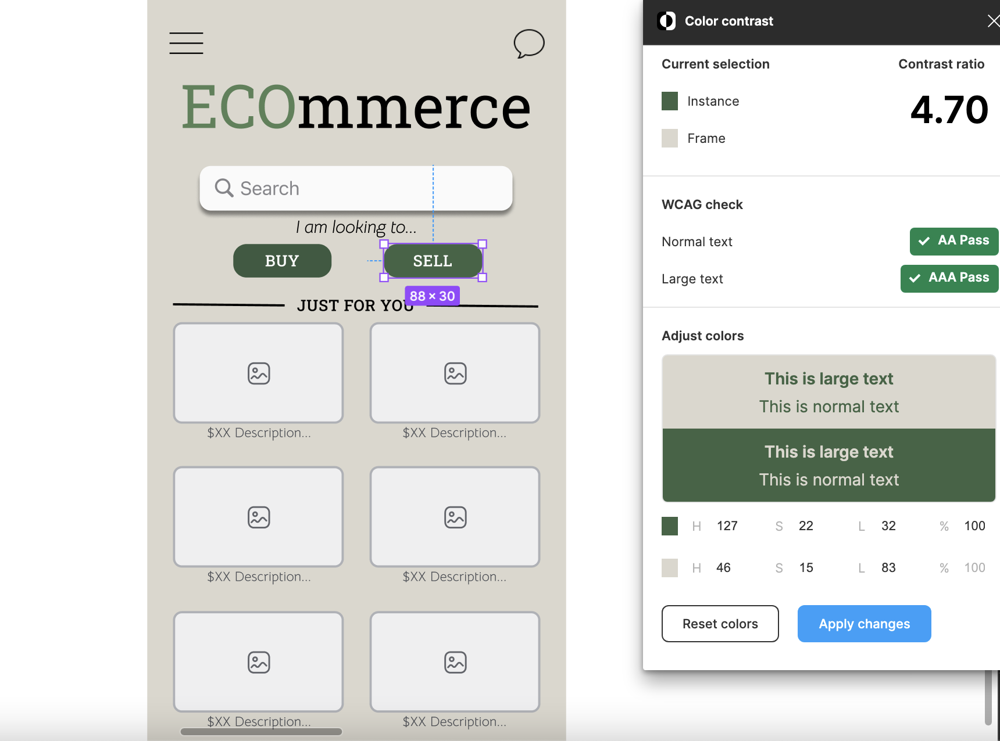  | 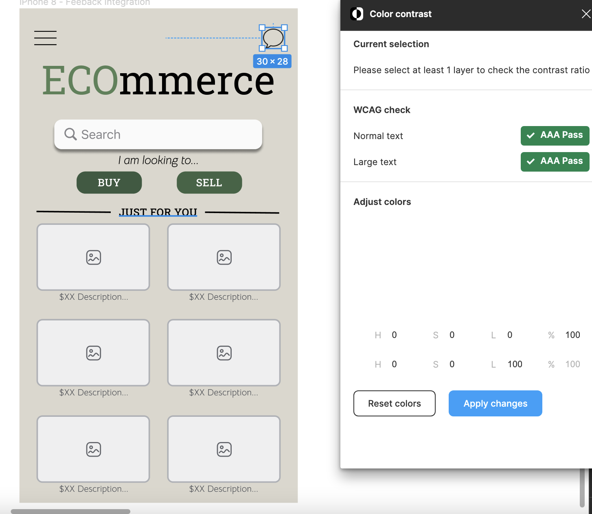  |

# Design Summary

Below is my final design and the specs for each aspect in the design.
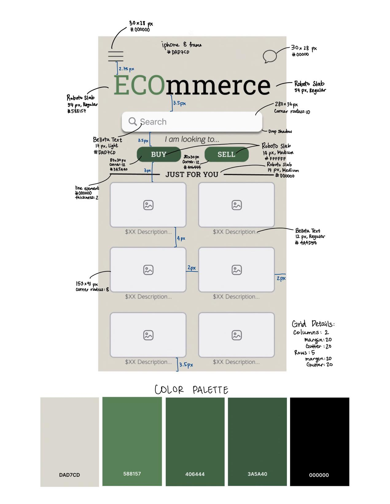

