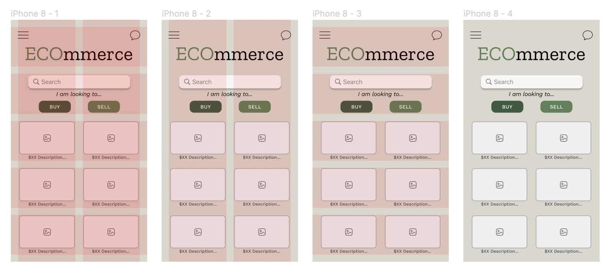
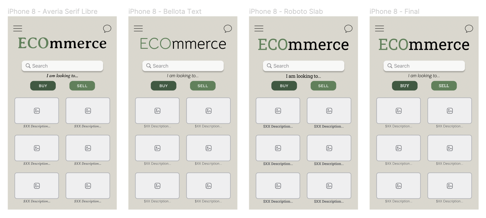
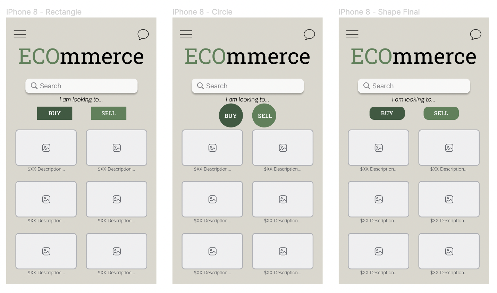
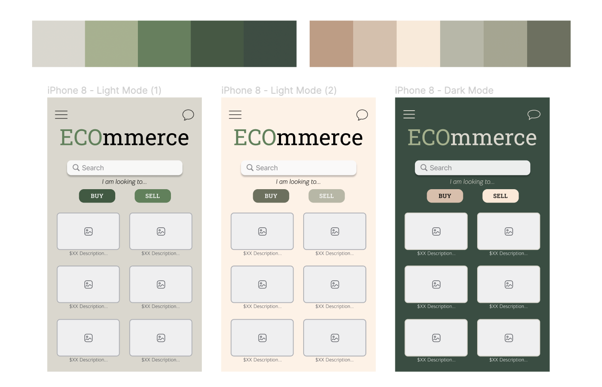

# Interface Design
## Assignment 6
Ashley Lee | DH110

## Project Description

This assignment aims to explore potential designs of my marketplace platform. The platform allows users to sell and buy second hand products while learning about the impact their actions (selling/buying a specific product) have on their ecological footprint. For example, with each product page that users are looking to purchase, there is a feature that will tell them how much of their ecological footprint they are reducing. The screen that I chose to design is the homepage, which asks the user what they are trying to do: sell or buy a product. 

## Purpose of UX Interface Design

The purpose of UX Interface Design is to convert low-fidelity wireframes into digitized designs that can later be transformed into interactive prototypes and eventually a final application. This provides the designer with another opportunity to get feedback and test out their design from a target user.

## Design Process

I based this interface design off of my low fidelity prototype as a reference. However, there are some changes in the design since I wanted to test out a slightly different idea to involve the ecological footprint factor. I started off with an iPhone 8/SE frame. I drafted out the layout from my low-fidelity prototype and included more details. This frame captures the main features of the application, allowing users to select if they are trying to purchase or sell an item and explore other items catered to their interest in an 'explore' page. During my process, I tested different typography, shape, and color variations for the app's main "Sell/Buy" page. After completion of the design, I ran two impression tests to further assist my process. I also ran an accessibility test to check for proper color contrast.

- [Figma Full Design Page](https://www.figma.com/file/U6vsPQLgZCa5sggQXV0fFn/Design-System%3A-TuneMate?node-id=0%3A1)
  - includes test screens, design system info, and digitized wireflow

#### Initial Wireframe of the "Lessons" Page that I will design:

  

## Graphical Interface Design Variation

## Design and GUI Component Layout

### Decision Process and Design Details
I decided to design the main "Sell/Buy" page. I chose this frame because it captures the main page of functions that the user can do on the app, which are to either buy or sell products. The overall layout of this page includes a search bar for what item they are looking to buy/sell, and then two buttons that allow them to choose whether they are trying to buy or sell that product to complete their search query. Below this section are some products that are generated to their liking for them to explore. The overall layout of this page includes a menu button, chat button, title of the application, sell/buy buttons, search bar, and product images. For the grid layout, I utilized 5 rows with 20px gutter and 20px margin, and 2 columns with 20px gutter and 20px margin. The rows were used to align the different sections of the page, including the search bar component and the 'explore' section. The columns were used to align the product photos in the 'explore' section, since I wanted to have two columns of products. To incorporate Gestalt's principles of design, I tried to incorporate a symmetric layout, hence the distirbution of elements in the page.

## Typography Variations

### Decision Process and Design Details
I tried out the following typography variations using [Google Fonts](https://fonts.google.com/): Averia Serif Libre, Bellota Text, and Roboto Slab. I wanted to find a balance between something that was playful and professional. I decided to try out Averia Serif Libre as something that was more professional. However, it ended up looking a bit too serious/ancient so I tried to find something that looked more 'light-hearted'. I then tried out Bellota Text, which seemed to be more casual and less stern. However, I felt that I wanted something that had a bolder appearance, especially when presenting the application's name. I then tried out Roboto Slab, which had a balance between these two fonts. Since I wanted that bolder presentation of the logo, I used Roboto Slab. I also wanted the 'Buy' and 'Sell' buttons to stand out, so I used Roboto Slab for those. For the remaining text on the page, I settled on Bellota Text, since there were not too bold but were still clear enough to clearly communicate to the user. My final topography is shown at the very right in the image above. 

***Details for these fonts are below:***

| Text | Typeface | Font Size | Weight |
|---|---|---|---|
| Main Title | Roboto Slab | 54px | Regular |
| "I am looking to..." | Bellota Text | 16px | Italic |
| Button Labels | Roboto Slab | 14px | Medium |
| Photo/product descriptions| Bellota Text | 12px | Regular |

## Button Variations

### Decision Process and Design Details
I tested the three following button variations: rectangle with sharp corner, circle, and rectangle with rounded corners. I decided to try out the rectangle with sharp and rounded corners since I thought those were pretty standard button design in web applications. For my third option, I decided to try out circles, since that was initially what I envisioned when illustrating my low-fidelity prototype. However, the circles did not seem to fit as nicely on the page and was in an awkward position. while they are the main focus of the home page, there seems to be too much focus on the buttons when they are designed as circles. I decided to go with the rectangular buttons with rounded corners, because they can successfully convey their purpose to the user while not distracting them from the other features on the page.

I chose not to change the structure of the photo placeholders since I would like to keep them standard. 

***Details for the button I chose are below:***

| Width | Height | Padding | Radius |
|---|---|---|---|
| 88px | 33px | 16px (horiz), 12px (vert) | 12px |

## Color Variations

### Decision Process and Design Details
I tested three different color variations. I used [Coolors](https://coolors.co/palettes/trending) to decide what color palettes I would want to use in my design. Because this product is oriented toward sustainability and improving the Earth, I wanted to choose earthy tones that would hopefully allow the user to feel a sense of calmness. I feel that the green would help the users feel a closer connection to the earth/sustainability and would give them the mindset to want to be more environmentally conscious. I created two iterations of a light mode and one dark mode option. 

## Monochromatic Indigo Variations

### Decision Process and Design Details
To further test the color variations, I used a [Preference Test](https://usabilityhub.com/guides/preference-testing) to see which design was most appealing to users. The feedback I got from this test is as follows:

| Screen 1 | Screen 2 | Screen 3 |
|---|---|---|
| "The title looks a little too dark" | "It's too purple for me" | "The icons at the bottom are hard to see" |
| "I can't see the button labels very well" | "The menu icon is hard to see" | "I like this bluer color more" |
| "I don't like how the buttons are darker than the background" | "I like the buttons' contrast with the background" | "The buttons really stand out here" |

Overall, participants preferred Screen 3, with the minor issue that the bottom buttons were difficult to see. The title text has great contrast with the background design, making it stand out. The button labels stand out clearly against the light button color. And the menu and chat icons are a brighter color so they do not get lost in the dark background. I made some small changes to lighten the bottom bar, and my final color design is shown below (in light and dark mode).

## Impression Test
According to Yale University's [usability site](https://usability.yale.edu/usability-testing/impression-testing), two popular ways for impression testing are picking adjectives, and the five-second test. I decided to conduct both these tests with separate samples of participants. I made the Picking-Adjectives test through Google Forms, and sent the test to 50 undergraduate students at UCLA (sent via groupme). I made the Five-Second Test through Usability Hub, and sent this test to 20 friends and family living in Orange County (sent via iMessage). I felt that my close friends/family should take the Five-Second Test rather than the Adjectives test to reduce bias. The students participating in the Adjectives test were past classmates who I have never met in person. 13 responses were submitted for the Five-Second Test, and 36 responses were submitted for the Picking-Adjectives Test. Results are below:

### Five-Second Test Results
- [Test Link](https://app.usabilityhub.com/do/809e883c8d25/1156)
- [Result Link](https://app.usabilityhub.com/tests/809e883c8d25/results/428fc872da2f)

  
  

### Observations
Based on results for the "What is this app used for" question, the top impressions users noted were music, learning, tuning, and reading. It was interesting to see that many users believed the app's purpose was for tuning instruments. I think that this was a common answer because the app name is "TuneMate". Perhaps I should consider exploring other name options for the application, because the word "Tune" might be misleading for the app's purpose. However, "music" and "learning" were the most popular answers, which tells me that the main purpose of the app was conveyed to most users. Based on results for the word/sentence recall question, most users recalled rhythm, reading, fundamentals, and basic. These results demonstrated that the overall lesson names really stood out to users.

### Picking-Adjectives Test Results
- [Test Link](https://forms.gle/N1bJCiBRc2SVrBck7)
- [Results CSV](https://docs.google.com/spreadsheets/d/1g1CKhkWu_7A0O1mrV_O0AlGM9rhEp_qRgdgSgpGE7Eg/edit?usp=sharing)

  
  
  

### Observations
Based on these results, it appeared that most users felt the app looked calm, simple, fresh, and useful. Many users also felt that the app apeared familiar and professional. It was encouraging to see these results, because I hoped to make the design as simple as possible but still appear useful and professional. A few users also said the app appeared to look cheap. I reached out to some design friends and they noted that the bottom-bar icons devalue the overall look. As I continue my design process, I will investigate other icon options and spend more time choosing icons that look sophisticated and fit the design well.

## Accessibility Test
To run a color-contrast check of my final design, I utilized the Spark plugin in Figma. The test results are shown below:

# Design Summary

