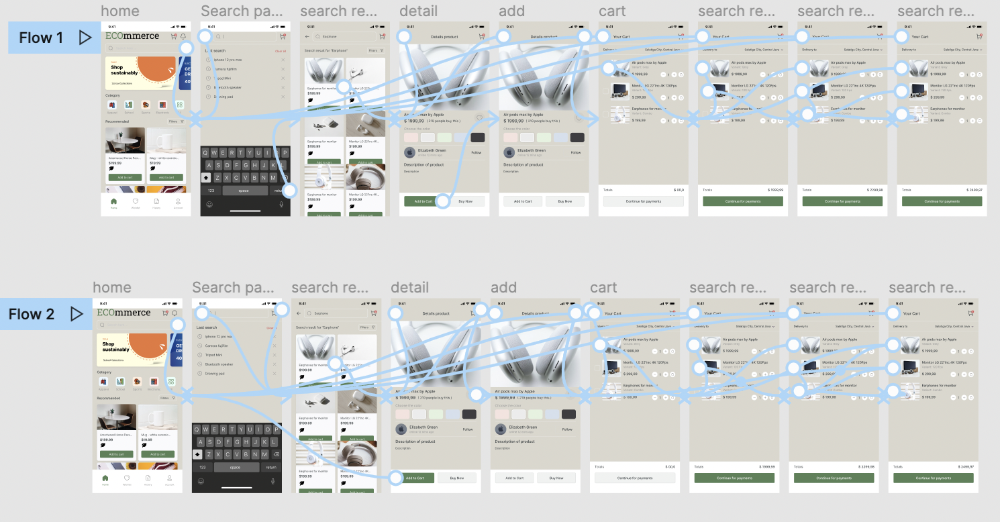

# High Fidelity Prototype
## Assignment 7
Ashley Lee | DH110

## Project Description

This assignment aims to explore potential designs of my marketplace platform. The platform allows users to sell and buy second hand products while learning about the impact their actions (selling/buying a specific product) have on their ecological footprint. For example, with each product page that users are looking to purchase, there is a feature that will tell them how much of their ecological footprint they are reducing, ultimately distinguishing this product from other ecommerce platforms.

## Purpose of Interactive Prototype

The purpose of this interactive prototype is to further develop the application and test its usability. By creating an interactive prototype, I, along with other users, are able to try the product and test its functionality. I will be able to test whether the flows that I designed are intuitive for the user and identify necessary improvements. This process will also allow the product designer to focus on usability of the product in conjunction with its design.

## Process of Interactive Prototype
I based my high-fidelity interactive prototype off of my low-fidelity prototype and interface design (from the past two assignments). After designing this in Figma, I conducted a usability test and cognitive walkthrough and made appropriate changes to my prototype.

## Tasks
*Below are a list of tasks that my interactive prototype can support:*
1. Browse for an item to purchase and identify its ecological footprint number
2. List an item to sell

## Wireflow
Identify the full wireflow [here](https://www.figma.com/proto/VpqdgQCq4hXkTaxqyZjZRL/Assignment-7---High-Fidelity-Prototype?node-id=37%3A624&scaling=scale-down&page-id=0%3A1&starting-point-node-id=37%3A624).

## Usability Testing
The main feedback I received was with the carbon footprint leaves. They were initially unsure of what the leaves referred to since I did not include an explanation for them. I was advised to have a question button next to them or in a tutorial when opening up the application. My user did say that the leaves were easy to notice but was just not sure what they meant- maybe it would be more effective to do a 5 star/leaf rating system instead of values.

My user also said that the background color of the application was distracting and dull, which was new to me, since I did not previously have an issue with this during the interface design round. I will look into possibly modifying this into something that is more appealing, such as white. 

Additionally, my user suggested that I make the application look more sustainability oriented, by including more educational material on sustainability. To do this, I can perhaps add articles that explain second hand shopping and other ways to live out more sustainable lifestyles.

Overall, the feedback from my user was helpful since the discussion points were ideas that I have not explored or really considered before.

